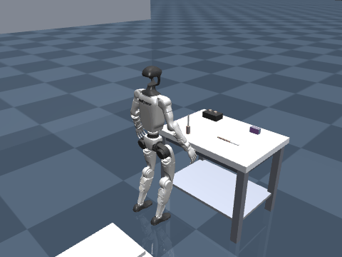

# RL Loco-Manipulation on the Unitree G1

Task-level reinforcement learning (reach, grasp, lift, button-press) layered on top of the
[AMO](https://amo-humanoid.github.io/) whole-body controller, simulated in MuJoCo on the Unitree G1 humanoid.



## Current status

`v5.5` is the first policy with nonzero **deterministic** success on the full reach-grasp-lift task:
**40% grasp / 30% lift / 0% falls** over 20 random-spawn episodes (grasp typically within ~0.5 s; tool held
rigidly with no levitation). Full iteration history lives in [TRAINING_LOG.md](TRAINING_LOG.md); the latest
overnight analysis is in [MORNING_REPORT.md](MORNING_REPORT.md). Checkpoint of record:
`checkpoints/v55_final.zip`.

## Architecture

- **L1 — AMO** (`amo_jit.pt`, `adapter_jit.pt`): pretrained whole-body controller (legs + torso, 50 Hz),
  used as-is for balance and locomotion.
- **L2 — task policies** (this repo): PPO policies commanding the arm on top of AMO. Honest contact-gated
  grasping (no latch-across-gap), closeness-scaled approach incentives, lift-dominant reward, adaptive
  spawn curriculum.

## Key files

| File | Purpose |
|---|---|
| `env_wrapper.py` / `env_wrapper_button.py` / `env_wrapper_universal.py` | Gym-style envs wrapping MuJoCo + the AMO controller |
| `reward_fn.py` | Task reward (contact-gated grasp, calm-approach, lift-dominant) |
| `train.py` | Main PPO training (reach-grasp-lift) |
| `train_button.py` | Button-press task training |
| `_eval_policy.py` | Deterministic N-episode eval harness (metrics + GIF render) |
| `_viewer.py` | Live MuJoCo viewer driven by the real AMO controller |
| `g1.xml`, `interactive_objects.xml`, `meshes/` | Scene description (G1 + factory cell) |

## Quickstart

```bash
pip install -r requirements.txt

# train (reach-grasp-lift)
python train.py --total_timesteps 400000 --curriculum true --run_name v5.x-grasp

# evaluate a checkpoint deterministically (the only metric that counts)
python _eval_policy.py --model checkpoints/v55_final.zip --episodes 20 --gif eval.gif

# watch live
python _viewer.py
```

## Conventions

- Success claims come from **deterministic** evals only — exploration luck is not skill.
- Every training iteration gets a row in `TRAINING_LOG.md` and a named wandb run (`vX.Y-task-MMDD`).
- Videos are frame-checked before any claim of success.

## Attribution & license

- AMO controller weights and interface: [AMO — Adaptive Motion Optimization](https://amo-humanoid.github.io/)
  (Li, Cheng, Huang, Wang — RSS 2025), Apache License 2.0. See [LICENSE](LICENSE).
- Unitree G1 model and meshes derive from Unitree's robot description (BSD-3-Clause).
- Everything else (environments, rewards, training/eval code) © 2026, released under Apache License 2.0.
